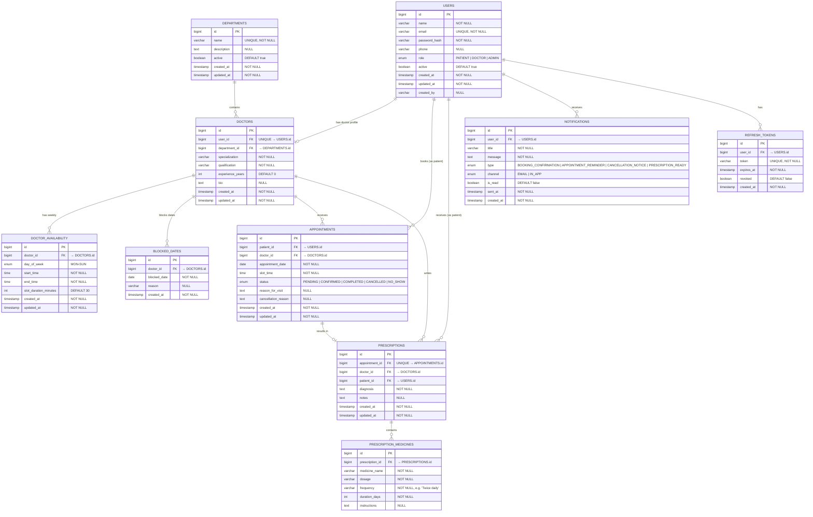

# 🗄️ ER Diagram — MedBook

## Rendered Diagram

---

## Overview

This Entity-Relationship diagram represents the complete database schema for MedBook, including all tables, primary/foreign keys, data types, constraints, and cardinalities. Join tables are used for many-to-many relationships.

---

## ER Diagram (Mermaid)

---

## Table Summary

| Table                    | Description                                          | Key Relationships                    |
|--------------------------|------------------------------------------------------|--------------------------------------|
| `USERS`                  | All system users (patients, doctors, admins)          | PK: `id`                            |
| `DEPARTMENTS`            | Hospital/clinic departments                          | PK: `id`                            |
| `DOCTORS`                | Doctor profiles linked to users                      | FK: `user_id`, `department_id`       |
| `DOCTOR_AVAILABILITY`    | Recurring weekly time slots per doctor               | FK: `doctor_id`                      |
| `BLOCKED_DATES`          | Dates when doctor is unavailable                     | FK: `doctor_id`                      |
| `APPOINTMENTS`           | Patient-doctor appointments                          | FK: `patient_id`, `doctor_id`        |
| `PRESCRIPTIONS`          | Prescriptions for completed appointments             | FK: `appointment_id`, `doctor_id`, `patient_id` |
| `PRESCRIPTION_MEDICINES` | Individual medicines in a prescription               | FK: `prescription_id`               |
| `NOTIFICATIONS`          | User notifications (email & in-app)                  | FK: `user_id`                        |
| `REFRESH_TOKENS`         | JWT refresh tokens for session management            | FK: `user_id`                        |

---

## Cardinalities Explained

| Relationship                        | Cardinality  | Explanation                                              |
|-------------------------------------|-------------|----------------------------------------------------------|
| Users → Doctors                     | `1 : 0..1`  | A user may optionally have a doctor profile              |
| Departments → Doctors              | `1 : 0..*`  | A department can have many doctors                       |
| Doctors → DoctorAvailability       | `1 : 0..*`  | A doctor has multiple weekly availability entries         |
| Doctors → BlockedDates             | `1 : 0..*`  | A doctor can block multiple dates                        |
| Users → Appointments (patient)     | `1 : 0..*`  | A patient can have many appointments                     |
| Doctors → Appointments             | `1 : 0..*`  | A doctor can have many appointments                      |
| Appointments → Prescriptions       | `1 : 0..1`  | An appointment may result in one prescription            |
| Prescriptions → PrescriptionMedicines | `1 : 1..*` | A prescription has at least one medicine               |
| Users → Notifications              | `1 : 0..*`  | A user can receive many notifications                    |
| Users → RefreshTokens              | `1 : 0..*`  | A user can have multiple active refresh tokens           |

---

## Constraints & Indexes

| Constraint Type         | Table              | Column(s)                                  | Description                                      |
|------------------------|--------------------|--------------------------------------------|--------------------------------------------------|
| **UNIQUE**             | USERS              | `email`                                    | No duplicate email addresses                     |
| **UNIQUE**             | DOCTORS            | `user_id`                                  | One doctor profile per user                      |
| **UNIQUE**             | DEPARTMENTS        | `name`                                     | No duplicate department names                    |
| **UNIQUE**             | PRESCRIPTIONS      | `appointment_id`                           | One prescription per appointment                 |
| **UNIQUE**             | REFRESH_TOKENS     | `token`                                    | Token uniqueness                                 |
| **UNIQUE COMPOSITE**   | APPOINTMENTS       | `doctor_id`, `appointment_date`, `slot_time`| Prevent double-booking same slot                |
| **UNIQUE COMPOSITE**   | DOCTOR_AVAILABILITY| `doctor_id`, `day_of_week`                 | One config per day per doctor                    |
| **INDEX**              | APPOINTMENTS       | `patient_id`                               | Fast lookup by patient                           |
| **INDEX**              | APPOINTMENTS       | `doctor_id`, `appointment_date`            | Fast schedule lookup                             |
| **INDEX**              | NOTIFICATIONS      | `user_id`, `is_read`                       | Fast unread count query                          |
| **CHECK**              | DOCTOR_AVAILABILITY| `start_time < end_time`                    | Valid time range                                 |
| **CHECK**              | APPOINTMENTS       | `status IN (...)`                          | Valid status values only                         |
