# 🧱 Class Diagram — MedBook

## Rendered Diagram

---

## Overview

This class diagram shows the full backend architecture following **Clean Architecture** (Controller → Service → Repository) with clear OOP relationships — inheritance, composition, aggregation, and interface implementation.

---

## Class Diagram (Mermaid)

```mermaid
classDiagram
    direction TB

    %% ============================================================
    %% BASE ENTITY
    %% ============================================================
    class AuditableEntity {
        <<abstract>>
        #Long id
        #LocalDateTime createdAt
        #LocalDateTime updatedAt
        #String createdBy
        +getId() Long
        +getCreatedAt() LocalDateTime
        +getUpdatedAt() LocalDateTime
    }

    %% ============================================================
    %% ENUMS
    %% ============================================================
    class Role {
        <<enumeration>>
        PATIENT
        DOCTOR
        ADMIN
    }

    class AppointmentStatus {
        <<enumeration>>
        PENDING
        CONFIRMED
        COMPLETED
        CANCELLED
        NO_SHOW
    }

    class NotificationType {
        <<enumeration>>
        BOOKING_CONFIRMATION
        APPOINTMENT_REMINDER
        CANCELLATION_NOTICE
        PRESCRIPTION_READY
    }

    class NotificationChannel {
        <<enumeration>>
        EMAIL
        IN_APP
    }

    %% ============================================================
    %% ENTITY CLASSES
    %% ============================================================
    class User {
        -String name
        -String email
        -String passwordHash
        -Role role
        -boolean active
        -String phone
        +getFullName() String
        +isActive() boolean
    }

    class Doctor {
        -String specialization
        -String qualification
        -int experienceYears
        -String bio
        +getDisplayName() String
    }

    class Department {
        -String name
        -String description
        -boolean active
    }

    class DoctorAvailability {
        -DayOfWeek dayOfWeek
        -LocalTime startTime
        -LocalTime endTime
        -int slotDurationMinutes
    }

    class BlockedDate {
        -LocalDate date
        -String reason
    }

    class Appointment {
        -LocalDate appointmentDate
        -LocalTime slotTime
        -AppointmentStatus status
        -String reasonForVisit
        -String cancellationReason
        +confirm() void
        +complete() void
        +cancel(String reason) void
    }

    class Prescription {
        -String diagnosis
        -String notes
    }

    class PrescriptionMedicine {
        -String medicineName
        -String dosage
        -String frequency
        -int durationDays
        -String instructions
    }

    class Notification {
        -String title
        -String message
        -NotificationType type
        -NotificationChannel channel
        -boolean read
        -LocalDateTime sentAt
        +markAsRead() void
    }

    class TimeSlot {
        -LocalTime startTime
        -LocalTime endTime
        -boolean available
    }

    %% ============================================================
    %% INHERITANCE
    %% ============================================================
    AuditableEntity <|-- User
    AuditableEntity <|-- Doctor
    AuditableEntity <|-- Department
    AuditableEntity <|-- Appointment
    AuditableEntity <|-- Prescription
    AuditableEntity <|-- Notification
    AuditableEntity <|-- DoctorAvailability
    AuditableEntity <|-- BlockedDate

    %% ============================================================
    %% ENTITY RELATIONSHIPS
    %% ============================================================
    User "1" --> "1" Role : has
    Doctor "1" --> "1" User : extends (user profile)
    Doctor "1" --> "1" Department : belongs to
    Doctor "1" --> "*" DoctorAvailability : has weekly
    Doctor "1" --> "*" BlockedDate : has
    Appointment "1" --> "1" User : patient
    Appointment "1" --> "1" Doctor : doctor
    Appointment "1" --> "1" AppointmentStatus : has
    Prescription "1" --> "1" Appointment : for
    Prescription "1" --> "1" Doctor : written by
    Prescription "1" --> "*" PrescriptionMedicine : contains
    Notification "1" --> "1" User : recipient

    %% ============================================================
    %% REPOSITORY INTERFACES
    %% ============================================================
    class UserRepository {
        <<interface>>
        +findByEmail(String email) Optional~User~
        +existsByEmail(String email) boolean
    }

    class DoctorRepository {
        <<interface>>
        +findBySpecialization(String spec) List~Doctor~
        +findByDepartmentId(Long deptId) List~Doctor~
        +findAvailability(Long doctorId, DayOfWeek day) DoctorAvailability
    }

    class AppointmentRepository {
        <<interface>>
        +findByPatientId(Long patientId) List~Appointment~
        +findByDoctorIdAndDate(Long doctorId, LocalDate date) List~Appointment~
        +existsByDoctorAndDateAndSlot(Long doctorId, LocalDate date, LocalTime slot) boolean
    }

    class DepartmentRepository {
        <<interface>>
        +findByNameContaining(String name) List~Department~
    }

    class PrescriptionRepository {
        <<interface>>
        +findByAppointmentId(Long apptId) Optional~Prescription~
        +findByPatientId(Long patientId) List~Prescription~
    }

    class NotificationRepository {
        <<interface>>
        +findByUserIdOrderBySentAtDesc(Long userId) List~Notification~
        +countByUserIdAndReadFalse(Long userId) long
    }

    %% ============================================================
    %% SERVICE INTERFACES
    %% ============================================================
    class AuthService {
        <<interface>>
        +register(RegisterDTO dto) RegisterResponseDTO
        +login(LoginDTO dto) LoginResponseDTO
        +refreshToken(String refreshToken) TokenDTO
    }

    class UserService {
        <<interface>>
        +getUserById(Long id) UserDTO
        +updateProfile(Long id, UpdateProfileDTO dto) UserDTO
        +toggleUserStatus(Long id) void
    }

    class DoctorService {
        <<interface>>
        +searchDoctors(DoctorFilterDTO filters) List~DoctorDTO~
        +getAvailableSlots(Long doctorId, LocalDate date) List~TimeSlotDTO~
        +setAvailability(Long doctorId, AvailabilityDTO dto) void
        +blockDate(Long doctorId, BlockDateDTO dto) void
    }

    class AppointmentService {
        <<interface>>
        +bookAppointment(BookingDTO dto, Long patientId) AppointmentDTO
        +cancelAppointment(Long apptId, Long userId, String reason) void
        +completeAppointment(Long apptId, Long doctorId) AppointmentDTO
        +getMyAppointments(Long userId, Role role) List~AppointmentDTO~
    }

    class PrescriptionService {
        <<interface>>
        +createPrescription(PrescriptionDTO dto, Long doctorId) PrescriptionDTO
        +getPrescriptionByAppointment(Long apptId) PrescriptionDTO
        +getMyPrescriptions(Long patientId) List~PrescriptionDTO~
    }

    class NotificationService {
        <<interface>>
        +sendNotification(Long userId, NotificationType type, String message) void
        +getMyNotifications(Long userId) List~NotificationDTO~
        +markAsRead(Long notifId) void
        +getUnreadCount(Long userId) long
    }

    %% ============================================================
    %% SERVICE IMPLEMENTATIONS
    %% ============================================================
    class AuthServiceImpl {
        -UserRepository userRepository
        -JWTUtil jwtUtil
        -PasswordEncoder passwordEncoder
        +register(RegisterDTO dto) RegisterResponseDTO
        +login(LoginDTO dto) LoginResponseDTO
        +refreshToken(String refreshToken) TokenDTO
    }

    class AppointmentServiceImpl {
        -AppointmentRepository appointmentRepository
        -DoctorRepository doctorRepository
        -NotificationService notificationService
        -SlotFactory slotFactory
        +bookAppointment(BookingDTO dto, Long patientId) AppointmentDTO
        +cancelAppointment(Long apptId, Long userId, String reason) void
        +completeAppointment(Long apptId, Long doctorId) AppointmentDTO
    }

    class NotificationServiceImpl {
        -NotificationRepository notificationRepository
        -NotificationStrategy strategy
        +sendNotification(Long userId, NotificationType type, String message) void
    }

    AuthService <|.. AuthServiceImpl : implements
    AppointmentService <|.. AppointmentServiceImpl : implements
    NotificationService <|.. NotificationServiceImpl : implements

    %% ============================================================
    %% DESIGN PATTERNS
    %% ============================================================

    %% Strategy Pattern
    class NotificationStrategy {
        <<interface>>
        +send(Notification notification) void
    }

    class EmailNotificationStrategy {
        +send(Notification notification) void
    }

    class InAppNotificationStrategy {
        +send(Notification notification) void
    }

    NotificationStrategy <|.. EmailNotificationStrategy : implements
    NotificationStrategy <|.. InAppNotificationStrategy : implements
    NotificationServiceImpl --> NotificationStrategy : uses

    %% Factory Pattern
    class SlotFactory {
        +generateSlots(DoctorAvailability availability, LocalDate date) List~TimeSlot~
    }

    AppointmentServiceImpl --> SlotFactory : uses

    %% ============================================================
    %% CONTROLLERS
    %% ============================================================
    class AuthController {
        -AuthService authService
        +register(RegisterDTO) ResponseEntity
        +login(LoginDTO) ResponseEntity
        +refreshToken(RefreshTokenDTO) ResponseEntity
    }

    class DoctorController {
        -DoctorService doctorService
        +searchDoctors(filters) ResponseEntity
        +getAvailableSlots(Long id, LocalDate date) ResponseEntity
        +setAvailability(AvailabilityDTO) ResponseEntity
    }

    class AppointmentController {
        -AppointmentService appointmentService
        +bookAppointment(BookingDTO) ResponseEntity
        +getMyAppointments() ResponseEntity
        +cancelAppointment(Long id) ResponseEntity
        +completeAppointment(Long id) ResponseEntity
    }

    class PrescriptionController {
        -PrescriptionService prescriptionService
        +createPrescription(PrescriptionDTO) ResponseEntity
        +getByAppointment(Long apptId) ResponseEntity
        +getMyPrescriptions() ResponseEntity
    }

    class AdminController {
        -UserService userService
        -DepartmentRepository departmentRepository
        +getAllUsers() ResponseEntity
        +toggleUserStatus(Long id) ResponseEntity
        +manageDepartments() ResponseEntity
        +getReports() ResponseEntity
    }

    %% ============================================================
    %% CONTROLLER → SERVICE DEPENDENCIES
    %% ============================================================
    AuthController --> AuthService : depends on
    DoctorController --> DoctorService : depends on
    AppointmentController --> AppointmentService : depends on
    PrescriptionController --> PrescriptionService : depends on
    AdminController --> UserService : depends on

    %% ============================================================
    %% SERVICE → REPOSITORY DEPENDENCIES
    %% ============================================================
    AuthServiceImpl --> UserRepository : depends on
    AppointmentServiceImpl --> AppointmentRepository : depends on
    AppointmentServiceImpl --> DoctorRepository : depends on
    AppointmentServiceImpl --> NotificationService : depends on
    NotificationServiceImpl --> NotificationRepository : depends on

    %% ============================================================
    %% EXCEPTION HIERARCHY
    %% ============================================================
    class BaseException {
        <<abstract>>
        #String message
        #HttpStatus status
    }

    class ResourceNotFoundException {
        +ResourceNotFoundException(String resource, Long id)
    }

    class DuplicateResourceException {
        +DuplicateResourceException(String message)
    }

    class SlotNotAvailableException {
        +SlotNotAvailableException(Long doctorId, LocalDate date, LocalTime slot)
    }

    class UnauthorizedException {
        +UnauthorizedException(String message)
    }

    class InvalidStatusTransitionException {
        +InvalidStatusTransitionException(String from, String to)
    }

    BaseException <|-- ResourceNotFoundException
    BaseException <|-- DuplicateResourceException
    BaseException <|-- SlotNotAvailableException
    BaseException <|-- UnauthorizedException
    BaseException <|-- InvalidStatusTransitionException

    %% ============================================================
    %% GLOBAL EXCEPTION HANDLER
    %% ============================================================
    class GlobalExceptionHandler {
        +handleResourceNotFound(ResourceNotFoundException) ResponseEntity
        +handleDuplicate(DuplicateResourceException) ResponseEntity
        +handleUnauthorized(UnauthorizedException) ResponseEntity
        +handleValidation(MethodArgumentNotValidException) ResponseEntity
        +handleGeneric(Exception) ResponseEntity
    }

    GlobalExceptionHandler --> BaseException : catches
```

---

## Key OOP Relationships

| Relationship      | Example                                                     |
|--------------------|-------------------------------------------------------------|
| **Inheritance**    | All entities extend `AuditableEntity`                       |
| **Implementation** | `AuthServiceImpl` implements `AuthService` interface        |
| **Composition**    | `Prescription` contains `PrescriptionMedicine` (lifecycle)  |
| **Aggregation**    | `Doctor` aggregates `DoctorAvailability` and `BlockedDate`  |
| **Dependency**     | Controllers depend on Service interfaces (DI)               |
| **Association**    | `Appointment` associates `User` (patient) and `Doctor`      |

## Design Patterns in Class Structure

| Pattern       | Classes                                                      |
|---------------|--------------------------------------------------------------|
| **Strategy**  | `NotificationStrategy` → `EmailNotificationStrategy`, `InAppNotificationStrategy` |
| **Factory**   | `SlotFactory` generates `TimeSlot` objects                   |
| **Repository**| All `*Repository` interfaces encapsulate data access         |
| **Singleton** | Logger instance (SLF4J) — used across all classes            |
| **Builder**   | DTO construction via Lombok `@Builder`                       |
