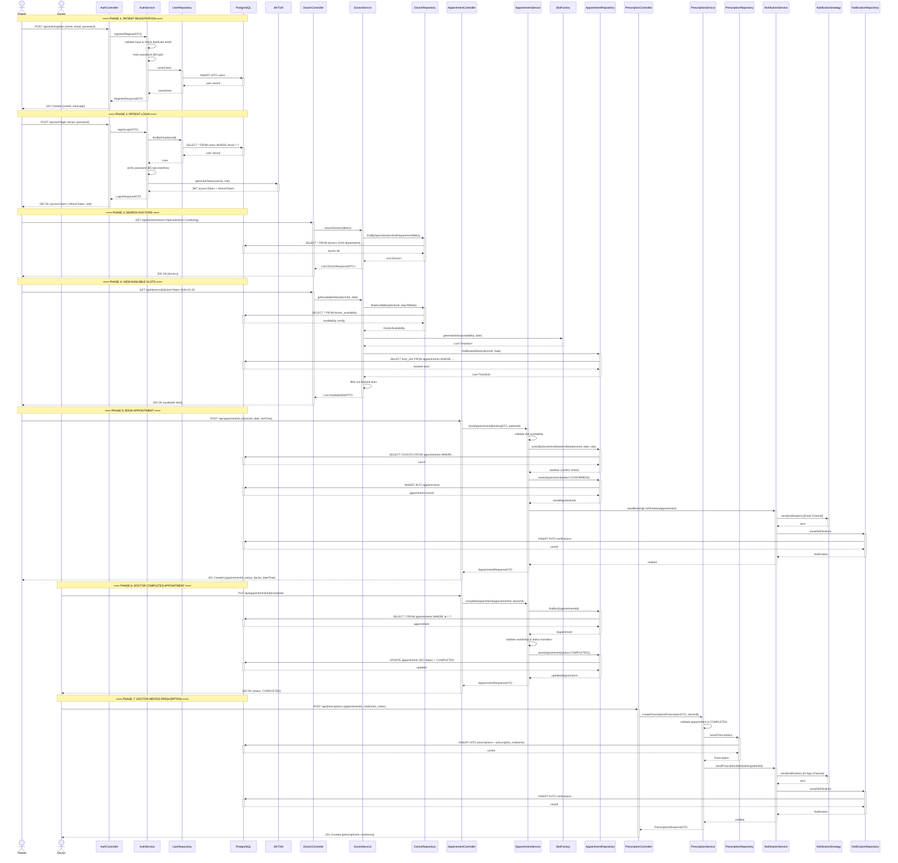

# 🔄 Sequence Diagram — MedBook

## Rendered Diagram

---

## Main End-to-End Flow

**Flow:** Patient Registers → Logs In → Searches Doctor → Books Appointment → Doctor Completes & Writes Prescription → Notifications Sent

This diagram traces the complete lifecycle from patient onboarding to appointment completion, showing the **Controller → Service → Repository → DB** layering at each step.

---

## Sequence Diagram (Mermaid)

---

## Flow Summary

| Phase | Action                     | Layers Involved                                  |
|-------|----------------------------|--------------------------------------------------|
| 1     | Patient Registration       | AuthController → AuthService → UserRepository    |
| 2     | Patient Login (JWT)        | AuthController → AuthService → JWTUtil           |
| 3     | Search Doctors             | DoctorController → DoctorService → DoctorRepo    |
| 4     | View Available Slots       | DoctorController → DoctorService → SlotFactory   |
| 5     | Book Appointment           | ApptController → ApptService → ApptRepo + Notif  |
| 6     | Complete Appointment       | ApptController → ApptService → ApptRepo          |
| 7     | Write Prescription         | PresController → PresSvc → PresRepo + Notif      |

---

## Design Patterns Visible in This Flow

| Pattern      | Where                                                                    |
|--------------|--------------------------------------------------------------------------|
| **Factory**  | `SlotFactory.generateSlots()` creates time slot objects from config      |
| **Strategy** | `NotificationStrategy` dispatches via Email or In-App channel            |
| **Observer** | Appointment events trigger notification side-effects                     |
| **Singleton**| Logger and SecurityContext used across all layers (not shown for brevity) |
| **Repository**| Spring Data JPA repositories abstract database queries                  |
