# 📋 Use Case Diagram — MedBook

## Rendered Diagram

---

## Actors

| Actor       | Description                                                      |
| ----------- | ---------------------------------------------------------------- |
| **Patient** | End user who registers, books appointments, views prescriptions  |
| **Doctor**  | Medical professional who manages schedule and treats patients    |
| **Admin**   | System administrator who manages users, departments, and reports |

---

## Use Case Diagram (Mermaid)

```mermaid
graph TB
    subgraph Actors
        Patient([🧑 Patient])
        Doctor([👨‍⚕️ Doctor])
        Admin([🔧 Admin])
    end

    subgraph "Authentication Module"
        UC1[Register Account]
        UC2[Login]
        UC3[Reset Password]
    end

    subgraph "Patient Features"
        UC4[Search Doctors]
        UC5[View Doctor Profile & Availability]
        UC6[Book Appointment]
        UC7[Cancel Appointment]
        UC8[View My Appointments]
        UC9[View Prescriptions]
        UC10[View Notifications]
        UC11[Update Profile]
    end

    subgraph "Doctor Features"
        UC12[Set Weekly Availability]
        UC13[Block Date / Mark Leave]
        UC14[View Scheduled Appointments]
        UC15[Complete Appointment]
        UC16[Write Prescription]
        UC17[View Patient History]
    end

    subgraph "Admin Features"
        UC18[Manage Departments - CRUD]
        UC19[Manage Doctor Profiles]
        UC20[Manage Users - Activate/Deactivate]
        UC21[View Appointment Reports]
        UC22[View System Logs]
    end

    subgraph "System"
        UC23[Send Booking Confirmation]
        UC24[Send Appointment Reminder]
        UC25[Send Cancellation Notification]
    end

    %% Patient connections
    Patient --> UC1
    Patient --> UC2
    Patient --> UC3
    Patient --> UC4
    Patient --> UC5
    Patient --> UC6
    Patient --> UC7
    Patient --> UC8
    Patient --> UC9
    Patient --> UC10
    Patient --> UC11

    %% Doctor connections
    Doctor --> UC2
    Doctor --> UC12
    Doctor --> UC13
    Doctor --> UC14
    Doctor --> UC15
    Doctor --> UC16
    Doctor --> UC17
    Doctor --> UC11

    %% Admin connections
    Admin --> UC2
    Admin --> UC18
    Admin --> UC19
    Admin --> UC20
    Admin --> UC21
    Admin --> UC22

    %% System triggers
    UC6 -.->|triggers| UC23
    UC6 -.->|triggers| UC24
    UC7 -.->|triggers| UC25

    %% Include/Extend relationships
    UC6 -.->|includes| UC2
    UC15 -.->|extends| UC16
```

---

## Use Case Summary Table

| #  | Use Case                   | Actor(s)         | Description                                              |
|----|----------------------------|------------------|----------------------------------------------------------|
| 1  | Register Account           | Patient          | New patient creates an account                           |
| 2  | Login                      | All              | Authenticate with credentials, receive JWT               |
| 3  | Reset Password             | Patient          | Request password reset via email link                    |
| 4  | Search Doctors             | Patient          | Filter doctors by specialization, department, name       |
| 5  | View Doctor Profile        | Patient          | See doctor details, ratings, and available slots         |
| 6  | Book Appointment           | Patient          | Select doctor, date, time slot and confirm booking       |
| 7  | Cancel Appointment         | Patient          | Cancel a pending/confirmed appointment                   |
| 8  | View My Appointments       | Patient          | List all past and upcoming appointments                  |
| 9  | View Prescriptions         | Patient          | View prescriptions from completed appointments           |
| 10 | View Notifications         | Patient          | View booking confirmations, reminders, updates           |
| 11 | Update Profile             | Patient, Doctor  | Edit personal information                                |
| 12 | Set Weekly Availability    | Doctor           | Define recurring weekly time slots                       |
| 13 | Block Date / Mark Leave    | Doctor           | Mark specific dates as unavailable                       |
| 14 | View Scheduled Appointments| Doctor           | See upcoming patient appointments                        |
| 15 | Complete Appointment       | Doctor           | Mark appointment as completed after consultation         |
| 16 | Write Prescription         | Doctor           | Create prescription for a completed appointment          |
| 17 | View Patient History       | Doctor           | See past appointments and prescriptions of a patient     |
| 18 | Manage Departments         | Admin            | Create, update, delete departments                       |
| 19 | Manage Doctor Profiles     | Admin            | Assign doctors to departments, update details            |
| 20 | Manage Users               | Admin            | Activate/deactivate user accounts                        |
| 21 | View Appointment Reports   | Admin            | Analytics on bookings, cancellations, completion rates   |
| 22 | View System Logs           | Admin            | Access application logs for monitoring                   |
| 23 | Send Booking Confirmation  | System           | Auto-notify patient on successful booking                |
| 24 | Send Appointment Reminder  | System           | Auto-remind patient before appointment                   |
| 25 | Send Cancellation Notice   | System           | Auto-notify on appointment cancellation                  |
